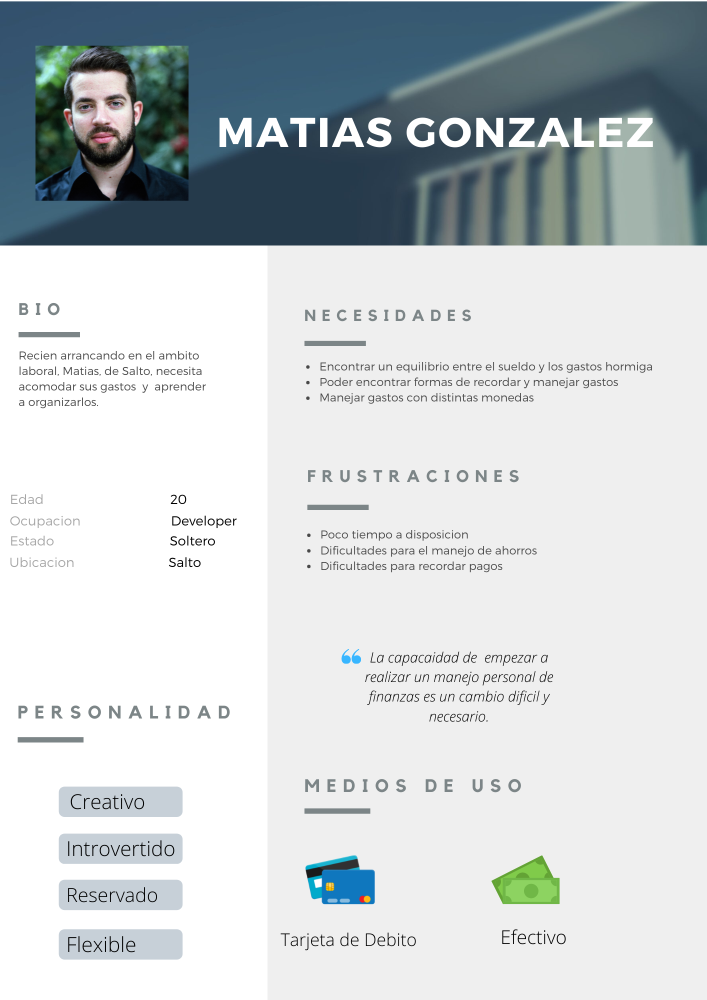
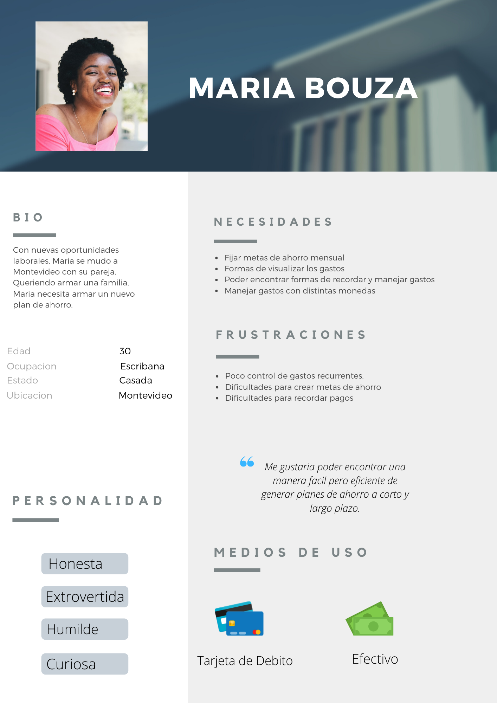
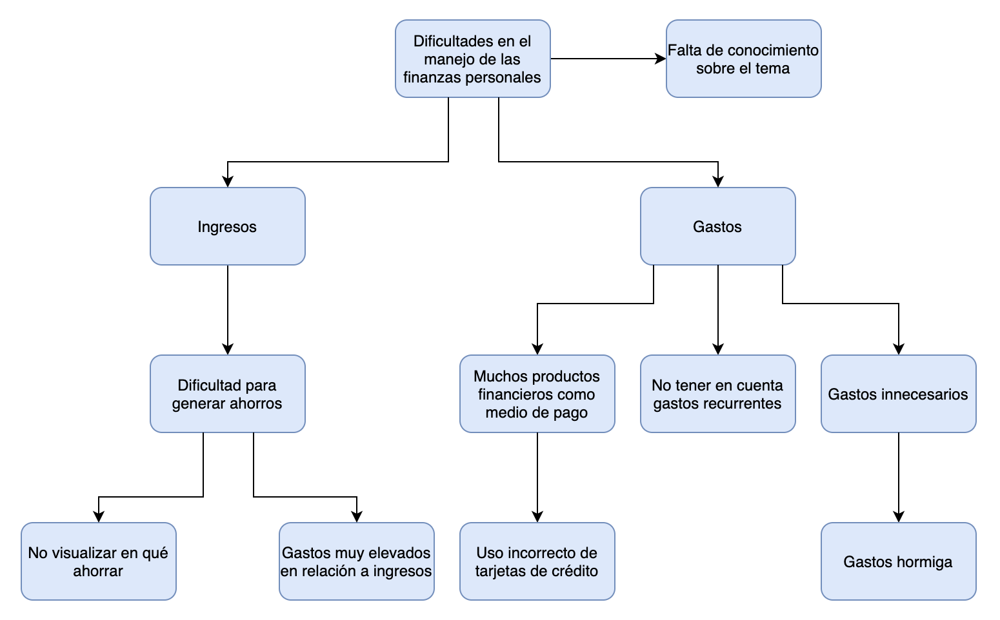

# Informe académico entrega 1
Fecha de entrega: 18-oct-2021

## Repositorio Git

### Creación y uso de repositorios locales y remotos

Para poder trabajar en el proyecto, cada integrante del equipo debió clonar el repositorio remoto, provisto por la cátedra, en su computadora, para así poder trabajar de manera local e independiente. Al momento de crear nuevas ramas es importante tener la rama de desarrollo local actualizada con la última versión de esta en el repositorio remoto para que no se pierdan las actualizaciones. 

### Comandos Git ejecutados desde terminal y desde el IDE

Para trabajar en el projecto los comandos de Git utilizados fueron los siguientes:

 <ul>
 <li>git clone 'url': para clonar el repositorio remoto</li>
 <li>git status: muestra la rama en la que nos encontramos posicionados y el estado de los archivos, si hubo modificaciones, si estas se encuentran en el area de stage o no y si hay algo para commitear</li>
 <li>git log: muestra el historial de commits de la rama actual </li>
 <li>git branch 'rama': crea una nueva rama con el nombre especificado </li>
 <li>git checkout 'rama': se posiciona en la rama especificada </li>
 <li>git checkout -b 'rama': crea una nueva rama con el nombre especificado y se posiciona en ella </li>
 <li>git add . : para agregar los archivos modificados al área de stage</li>
 <li>git commit -m 'mensaje': para guardar los cambios de los archivos en el área de stage en el repositorio local</li>
 <li>git push origin 'rama' : actualiza el repositorio remoto con los cambios locales</li>
 <li>git pull: actualiza el repositorio local con los últimos cambios del repositorio remoto (realiza un fetch y merge de la rama)</li>
 </ul>

Los merges fueron realizados desde GitHub. 

## Versionado

### Buenas prácticas de versionado

Al crear nuevas ramas se deberá seguir el siguiente criterio. 

 <ul><li>feature/<nombre>: para crear nuevas funcionalidades.</li><li>BUG/<nombre>: para corregir errores.</li></ul>

Será necesario realizar commits con mensajes claros, breves y descriptivos. Estos mensajes deberán ser escritos en español. En cada commit se deberá especificar cuál es la acción que se está realizando. Para ello se utilizarán las palabras clave "agregar", "cambiar", "arreglar", "quitar" al principio de cada mensaje de commit.

### Uso de ramas separadas de 'main'

Para el desarrollo del proyecto se tomó la decisión de trabajar en una rama secundaria llamada "Develop". Es así que todas las ramas generadas durante el transcurso del mismo serán mergeadas a Develop en una primera instancia, para luego, una vez que el proyecto se encuentre en su versión final, poder mergear esta rama a la rama "main".

### Resumen de commits y evolución del proyecto

Resumen de commits y evolución del proyecto

## Elicitación

### Evidencia de actividades de investigación

### Técnica de elicitación
#### Ingeniería reversa

Utilizaremos la ingeniería reversa para definir aspectos importantes que tendremos en cuenta a la hora de establecer los requerimientos de nuestra aplicación. Observamos la aplicación ZCuentas. Se trata de una aplicación para el registro de ingresos y gastos desarrollada en Uruguay pensada para el público local.

##### Elementos positivos:
<ul><li>Al agregar un gasto el sistema asigna por defecto la fecha de ese día.</li><li>La aplicación tiene conceptos predefinidos y además permite que el usuario agregue sus conceptos personalizados.</li><li>Se prevee el pago con efectivo, débito y crédito. Para este último se puede asignar el número de pagos.</li><li>Posibilidad de asignar recordatorios para recordar realizar pagos y cancelar deudas.</li><li>Permite agregar cuentas en moneda extranjera.</li></ul>
	
##### Elementos negativos:

<ul><li>No permite agregar gastos periódicos que se repitan de forma automática.</li><li>Al ingresar un gasto los conceptos se ordenan alfabéticamente en lugar de hacerlo por frecuencia de gastos, lo que resulta poco práctico.</li></ul>

#### Cuestionario

Con el objetivo de obtener un mejor entendimiento acerca de cuáles eran los factores más relevantes para el mercado en una aplicación de registro de gastos, realizamos un cuestionario dirigido al público objetivo de la aplicación. Para esto fue necesario definir el mismo, que lo ubicamos en jóvenes entre 18 y 30 años, es decir, aquellas personas que se encuentran ingresando al mercado laboral, que no necesariamente tienen personas a cargo, y que deben comenzar a manejar sus finanzas personales de manera independiente. 

Del cuestionario realizado se desprenden algunas conclusiones interesantes. En primer lugar, es importante destacar que si bien cerca del 50% de los encuestados no consideran tener dificultades para balancear sus ingresos y gastos, aproximadamente el 80% contestó que sí cree que una aplicación de registro de gastos le resultaría beneficiosa, cuando solo el 15% indicó utilizar alguna aplicación de este estilo actualmente. De esto podemos entender que existe una porción del mercado interesada en consumir una aplicación como MisGastos. 

Por otra parte, otro objetivo del cuestionario realizado era el de consultar con el público por determinadas funcionalidades interesantes para incorporar en la aplicación. De acuerdo a las respuestas obtenidas, las cuatro funcionalidades más relevantes serían las siguientes:

 <ul><li>Visualizar gráficamente los gastos del período.</li><li>Fijar metas de ahorro mensual.</li><li>Posibilidad de ingresar gastos fijos mensuales.</li><li>Gastos en más de una moneda.</li></ul>

Finalemente, en el cuestionario se consultó acerca de incorporar una funcionalidad para que el usuario pueda recibir notificaciones diarias a modo de recordatorio para registrar los gastos incurridos en cada día. Aproximadamente el 80% de las respuestas fueron favorables. 

### Referencias a fuentes de información

A modo de investigación decidimos analizar el funcionamiento de algunas aplicaciones de registro de gastos, o similares, existentes en el mercado. A pesar que en el punto de ingeniería reversa nos enfocamos en la aplicación uruguaya ZCuentas, también utilizamos como referencia algunas aplicaciones como Mobills, iGasto y MoneyControl. 

Por otra parte, como se mencionó anteriormente, también realizamos un cuestionario dirigido al público objetivo, que se encuentra en jóvenes entre 18 y 30 años.

A continuación se encuentran disponibles los resultados obtenidos a partir la investigación realizada. 

[Evidencia investigación](./investigacion/README.md)

### User Personas

### Modelo conceptual del problema

## Especificación

### Requerimientos funcionales y no funcionales

#### Requerimientos funcionales

<ul><li>El usuario debera poder registrarse en el sistema.</li><li>El usuario debe poder ver dentro de la aplicacion sus gastos e ingresos de forma ordenada.</li><li>El usuario tiene la posibilidad de crear recordatorios para recordar registrar sus gastos.</li><li>El usuario debe poder loggearse a su cuenta ingresando su usuario y contraseña.</li><li>El usuario debe poder escanear facturas para que sus gastos queden registrados.</li><li>El usuario debe poder ingresar gastos de forma manual.</li><li>El sistema debe permitir el ingreso de gastos en pesos uruguayos y en dólares americanos.</li><li>El usuario debe poder establecer topes de gastos por categoría mensual, y ser notificado en caso de sobrepasar esos límites.</li><li>El usuario debe poder ingresar gastos recurrentes una única vez y luego verlos cada mes en el reporte de gastos.</li></ul>

#### Requerimientos no funcionales

<ul><li>La aplicacion debera funcionar en IOS y Android.</li><li>El sistema debera soportar multiples usuarios concurrentes.</li><li>El sistema sera programado en Javascript.</li><li>Se utilizará como color pirmario Deep Purple 700 y como secundario Teal 700</li><li>La fuente a utilizar será Roboto.</li></ul>

### User Stories

ID: #1

Título: Registro de usuarios

Narrativa: Como usuario quiero poder registrame como usuario de la aplicación para poder mantener mi cuenta de registro de gastos.

Criterios de aceptación: 

<ul><li>El nombre de usuario debe ser un email.</li><li>La contraseña debe tener al menos ocho caracteres y un número.</li><li>Será necesario confirmar la contraseña ingresada para completar el proceso de registro.</li></ul>

ID: #2

Título: Ingreso al sistema

Narrativa: Como usuario quiero poder loggearme utilizando mi email y contraseña para poder acceder a mi cuenta.

Criterios de aceptación: 

<ul><li>Si se ingresa una contraseña incorrecta el sistema deberá notificar al usuario y proveer la opción de setear una nueva.</li></ul>

ID: #3

Título: Ingreso de gastos

Narrativa: Como usuario quiero poder ingresar gastos de forma manual para poder verlos en el resumen de gastos.

Criterios de aceptación: 

<ul><li>El usuario deberá ingresar una referencia asociada al gasto, el monto y asignarle una categoría.</li></ul>

ID: #4

Título: Gastos en múltiples monedas

Narrativa: Como usuario quiero poder ingresar gastos en pesos uruguayos y en dólares americanos para poder hacer un seguimiento de mis gastos en la moneada en que fueron realizados.

Criterios de aceptación: 

<ul><li>El registrar un gasto nuevo, el sistema debe solicitar que se seleccione una moneda, pesos uruguayos o dólares americanos.</li></ul>

ID: #6

Título: Topes de gastos

Narrativa: Como usuario quiero poder definir topes mensuales por categoría de gastos para poder controlar los gastos a realizar por categoría.

Criterios de aceptación: 

<ul><li>El sistema debe permitir fijar topes en pesos uruguayos y en dólares americanos.</li></ul>

ID: #7

Título: Notificaciones por topes de gastos

Narrativa: Como usuario quiero ser notificado en caso de exceder algún tope de gasto establecido para algunas de mis categorías para tener conocimiento sobre el cumplimiento de mis metas mensuales.

Criterios de aceptación: 

<ul><li>La notificación deberá ser visible desde la página de inicio.</li></ul>

ID: #8

Título: Gastos recurrentes

Narrativa: Como usuario quiero poder ingresar gastos recurrentes para no tener la necesidad de registrarlos cada mes.

Criterios de aceptación: 

<ul><li>El gasto ingresado deberá figurar en el resumen de gastos mensual sin necesidad de que el usuario lo ingrese nuevamente.</li></ul>

ID: #9

Título: Manejo gastos recurrentes

Narrativa: Como usuario quiero poder editar y eliminar gastos recurrentes para poder ajustarlos de acuerdo a su evolución.

Criterios de aceptación: 

<ul><li>Solamente se podrá editar el monto del gasto.</li><li>En el listado de gastos recurrentes debe verse un botón que permita eliminarlos automáticamento.</li></ul>

ID: #10

Título: Creación categorías de gastos

Narrativa: Como usuario quiero poder crear nuevas categorías de gastos para que las categorías reflejen adecuadamente el concepto de mis gastos.

Criterios de aceptación: 

<ul><li>El sistema deberá solicitar que se ingrese el nombre de la nueva categoría.</li></ul>

### Use Cases

Título: Registrar nuevo usuario

Actor: Usuario

Curso normal:

|           Acción de los actores       |                   Respuesta del sistema                     |
| ------------------------------------- | ----------------------------------------------------------- |
| 1. Selecciona 'registrarse'           | 2. Despliega pantalla con formulario de registro de usuarios|
| 3. Completa formulario de registro    | 4. Chequea formatos                                         |
| 5. Presiona botón 'registrarse'       | 6. Confirma registro de usuario exitoso e inicia sesión del usuario, redirige a pantalla de inicio |

Cursos alternativos:

3.1. El usuario ingresa una fecha de nacimiento correspondiente a una edad menor a 10 años o mayor a 100: el sistema arroja un error indicando que se debe ingresar una fecha de nacimiento válida.

3.2. El correo electrónico ingresado ya es utilizado por otro usuario: el sistema arroja error indicando que ya existe un usuario utilizando esa dirección en el sistema.

3.3. La contraseña ingresada no cumple con todos los requisitos necesarios: el sistema arroja error indicando que la contraseña indicando qué requisitos debe tener una contraseña válida. 

3.4. El campo 'verificar contraseña' no coincide con la contraseña ingresada: el sistema arroja un error indicando que los dos campos deben ser iguales.

Título: Inicio de sesión

Actor: Usuario

Curso normal:

|           Acción de los actores       |                        Respuesta del sistema                       |
| ------------------------------------- | ------------------------------------------------------------------ |
| 1. Ingresa email y contraseña         | 2. Chequea formatos                                                |
| 3. Presiona botón 'iniciar sesión'    | 4. Confirma usuario e inicia sesión, redirige a pantalla de inicio |

Cursos alternativos:

1.1. El formato de la dirección de email no es correcto: se despliega alerta indicando error de formato.

3.1. El usuario no esta registrado en el sistema: el sistema rechaza inicio de sesión y despliega opción para registrarse.

Título: Agregar gasto

Actor: Usuario

Curso normal:

|           Acción de los actores       |                  Respuesta del sistema                  |
| ------------------------------------- | ------------------------------------------------------- |
| 1. Selecciona 'Agregar gasto'         | 2. Despliega formulario de ingreso de gastos            |
| 3. Completa formulario de gasto       | 4. Confirma ingreso de gasto y despliega señal de éxito |

Cursos alternativos:

3.1. El concepto del gasto no figura en el sistema: usuario cancela ingreso de gasto y se dirige a ingresar el nuevo concepto.

3.2. Se ingresa más de un pago habiendo seleccionado un medio de pago que no admite pagos: el sistma arroja un error indicando que el medio de pago seleccionado no admite el pago en cuotas.

Título: Agregar Recordatorio

Actor: Usuario

Curso normal:

|           Acción de los actores        |                        Respuesta del sistema                         |
| -------------------------------------- | -------------------------------------------------------------------- |
| 1. Selecciona 'Agregar recordatorio'   | 2. Despliega formulario de ingreso de recordatorio                   |
| 3. Completa formulario de recordatorio | 4. Confirma ingreso de nuevo recordatorio y despliega señal de éxito |

Cursos alternativos:

3.1. La fecha ingresada es anterior a la fecha actual: sistema indica error indicando que solo se permite el ingreso de nuevos recordatorios con fechas futuras.

Título: Ver listado gastos

Actor: Usuario

Curso normal:

| Acción de los actores  |                 Respuesta del sistema                |
| ---------------------- | ---------------------------------------------------- |
| 1. Selecciona 'menu'   | 2. Despliega menu                                    |
| 3. Selecciona 'gastos' | 4. Despliega pantalla 'gastos' con listado de gastos |

Cursos alternativos:

4.1. El usuario no tiene gastos ingresados: se despliega pantalla de gastos vacía con indicación de que aún no hay gastos ingresados en el sistema.

Título: Ver listado ingresos

Actor: Usuario

Curso normal:

| Acción de los actores    |                 Respuesta del sistema                    |
| ------------------------ | -------------------------------------------------------- |
| 1. Selecciona 'menu'     | 2. Despliega menu                                        |
| 3. Selecciona 'ingresos' | 4. Despliega pantalla 'ingresos' con listado de ingresos |

Cursos alternativos:

4.1. El usuario no tiene ingresos ingresados: se despliega pantalla de ingresos vacía con indicación de que aún no hay ingresos ingresados en el sistema.

Título: Ver resumen gastos

Actor: Usuario

Curso normal:

| Acción de los actores   | Respuesta del sistema |
| ----------------------- | --------------------- |
| 1. Selecciona 'gastos'  | 2. Despliega pantalla 'gastos' mostrando gráfico de torta representativo de los gastos del período seleccionado, divididos por concepto  |

1.1. No hay gastos ingresados al sistma para el período seleccionado: se despliega pantalla de gastos vacía con indicación de que aún no hay gastos ingresados en el sistema para ese período.

Título: Ver resumen ingresos

Actor: Usuario

Curso normal:

|   Acción de los actores   | Respuesta del sistema |
| ------------------------- | --------------------- |
| 1. Selecciona 'ingresos'  | 2. Despliega pantalla 'ingresos' mostrando gráfico de torta representativo de los ingresos del período seleccionado, divididos por concepto  |

1.1. No hay ingresos ingresados al sistma para el período seleccionado: se despliega pantalla de ingresos vacía con indicación de que aún no hay ingresos ingresados en el sistema para ese período.

Título: Ver resultados

Actor: Usuario

Curso normal:

|    Acción de los actores    | Respuesta del sistema |
| --------------------------- | --------------------- |
| 1. Selecciona 'resultados'  | 2. Despliega pantalla resultados mostrando comparativo entre ingresos y gastos y saldo del período seleccionado    |

Bocetos de IU

## Validación y verificación

Verificar la especificación

Validar la solución con personas no involucradas en el proyecto

## Reflexión

Detalle del trabajo individual

Técnicas aplicadas y aprendizajes

