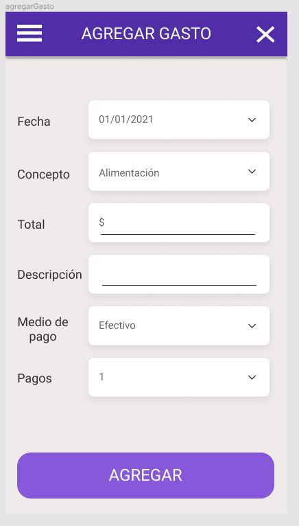
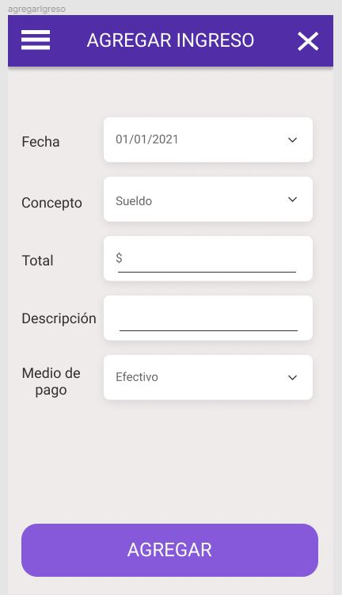
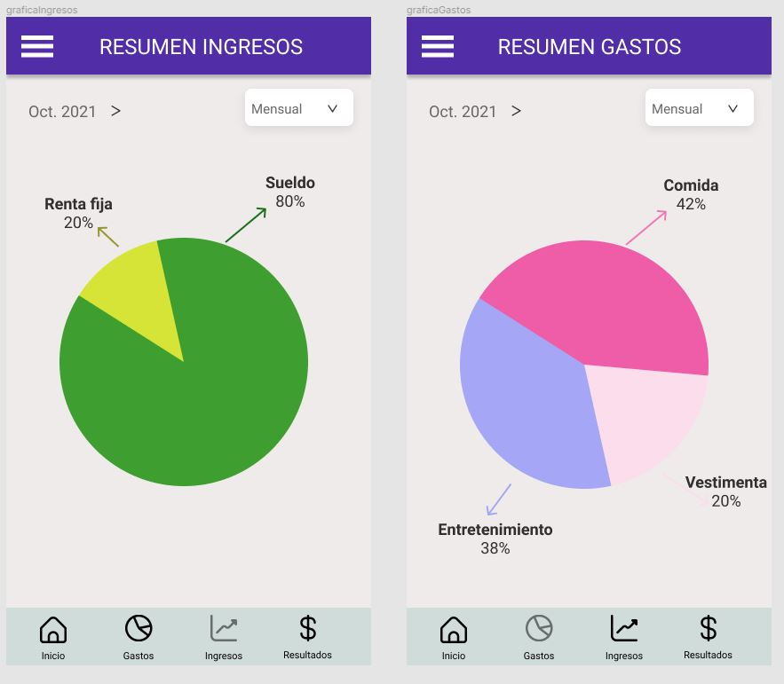

<h3>Primer boceto página de inicio y menu principal</h3>

<h3>Páginas agregar gasto y agregar ingreso</h3>

<h3>Menu lateral</h3>

<h3>Resumen ingresos y gastos</h3>

Vincular y explicar en el informe académico
