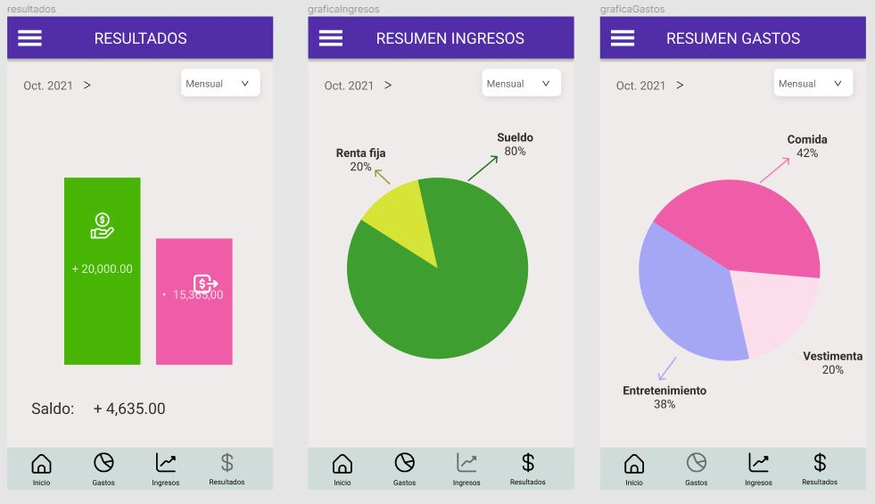
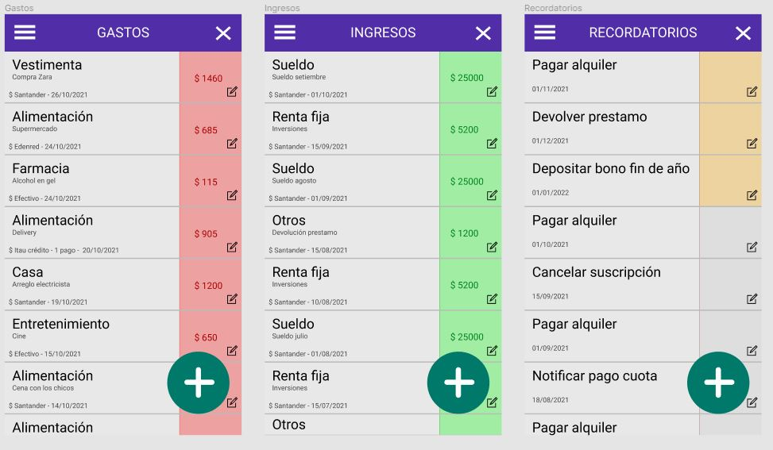
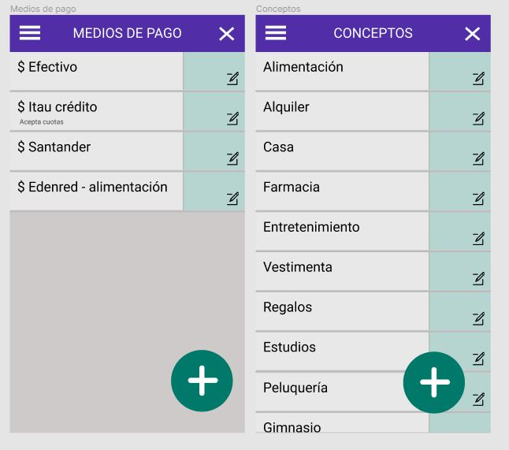
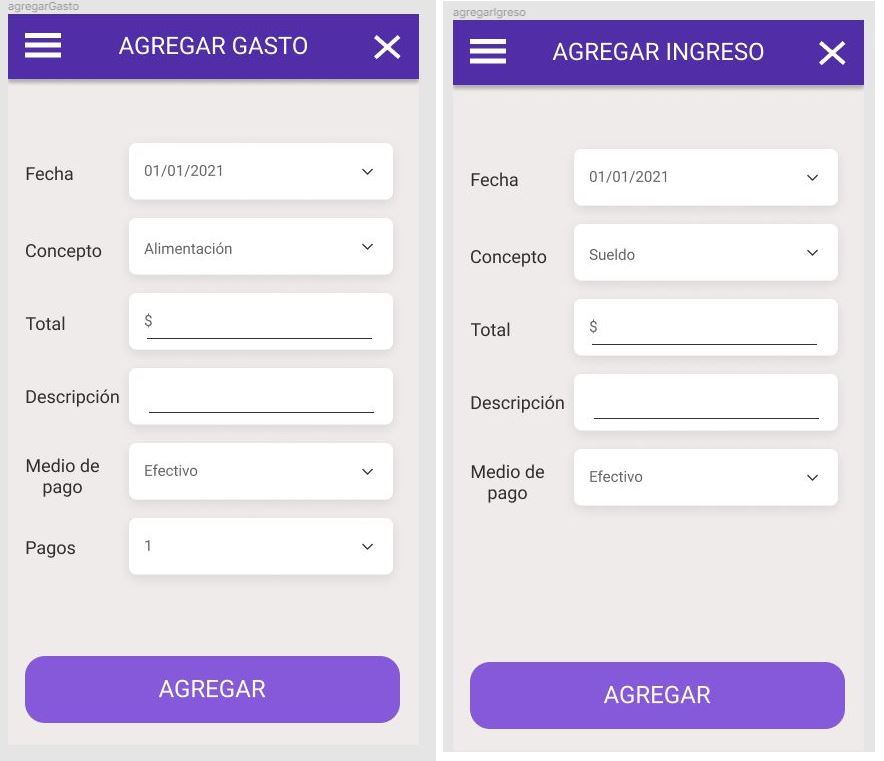

<h3>Página de inicio y menu principal</h3>

<h3>Menu lateral</h3>

<h3>Resultados, ingresos y gastos</h3>

<h3>Gastos, ingresos y recordatorios</h3>

<h3>Medios de pago y conceptos</h3>

<h3>Agregar gasto y agregar ingreso</h3>

Vincular y explicar en el informe académico
