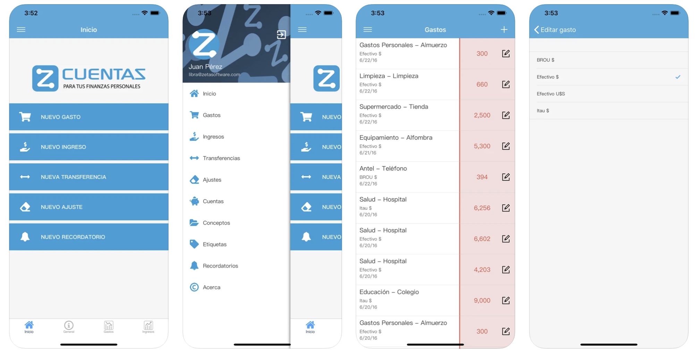
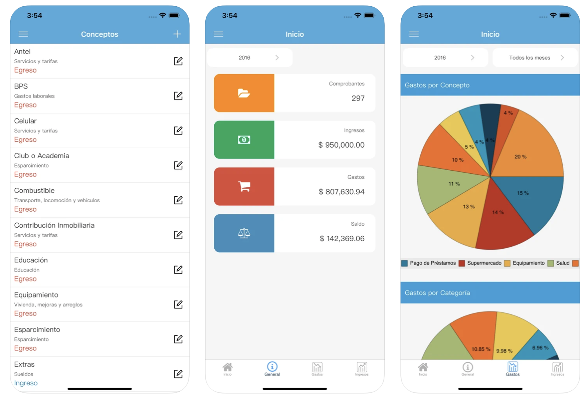
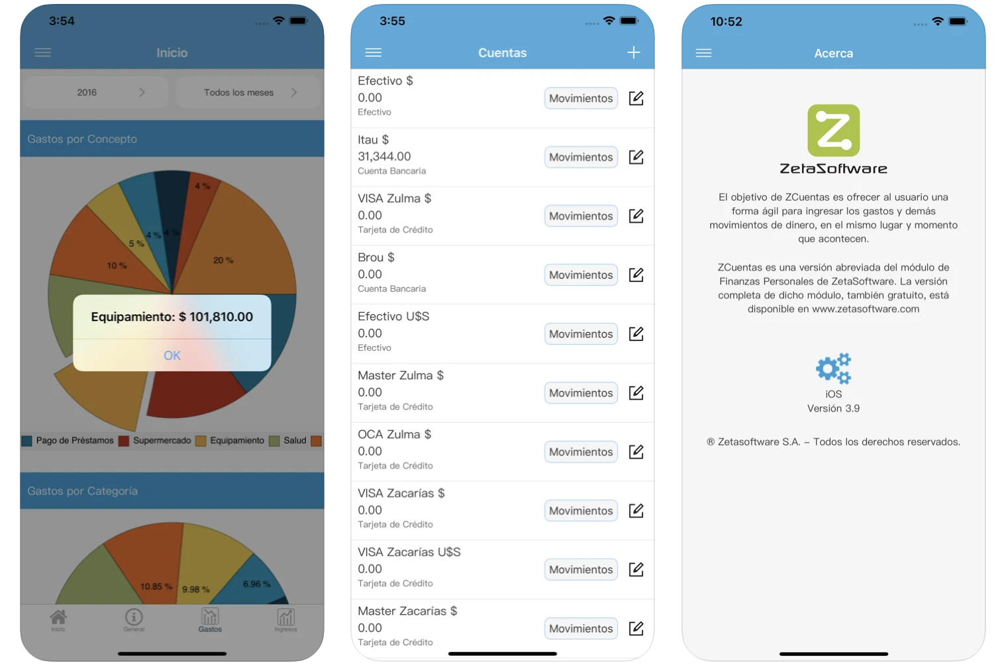
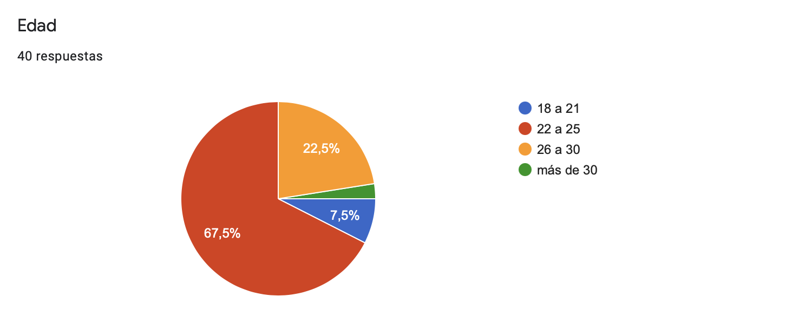
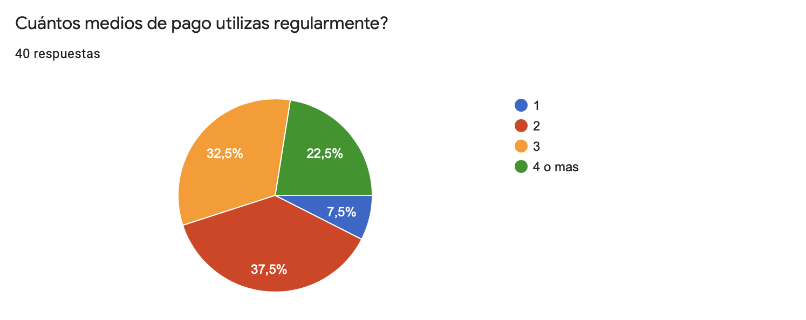
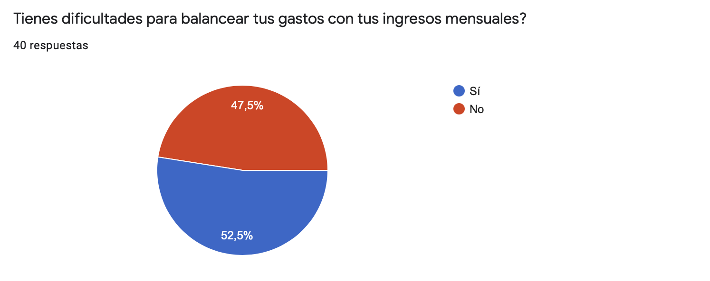
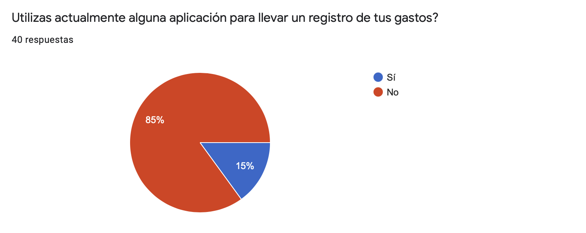
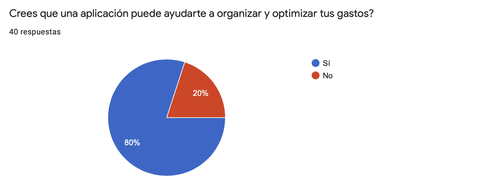
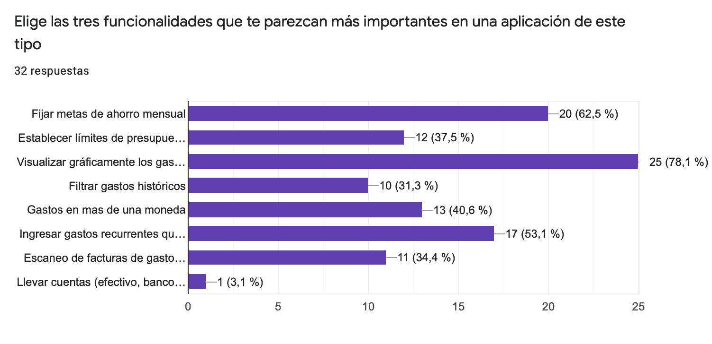
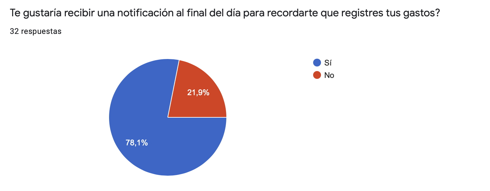

<h3>Evidencia Ingeniería Reversa: análisis de aplicación ZCuentas</h3>

<h3>Evidencia cuestionario</h3>

<h4>Información general sobre los usuarios que contestaron cuestionario</h4>

<h4>Acerca de una app de registro de gastos</h4>

