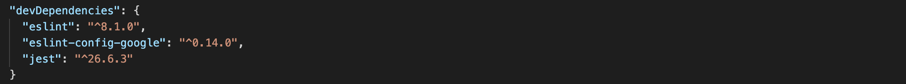
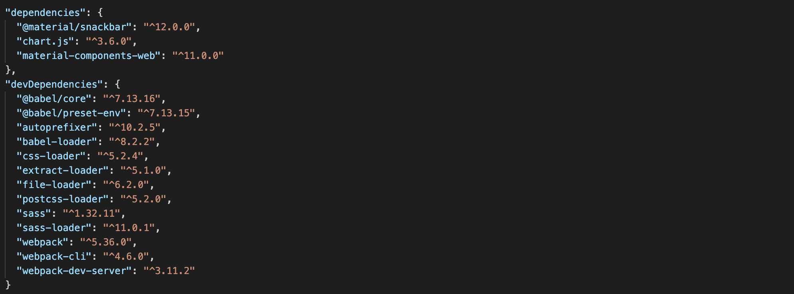

# Informe académico entrega 2
Fecha de entrega: 29-nov-2021

[Proyecto Mamrut, Mester, Pigatto](https://github.com/ORT-FIS-202108/proyecto-grupo_3_mamrut_mester_pigatto)

Mauricio Mamrut: 266946

Ivana Mester: 204318

Ignacio Pigatto: 204386

## Construcción

### Implementación de funciones principales (sin la necesidad de persistencia de datos)

Para la realización de la tarea decidimos implementar las funciones principales de la aplicación con el objetivo de obtener el mínimo producto viable. Dejamos de lado las funcionalidades que no aportan demasiado valor o aquellas que implican una implementación demasiado compleja.

#### Funcionalidades a implementar:

<ol><li>Visualización de gastos e ingresos de forma ordenada.</li><li>Posibilidad de crear recordatorios, categorías de gastos e ingresos personalizadas y diferentes tipos de medios de pago </li><li>Ingresar gastos e ingresos de forma manual</li><li>Establecer topes de gasto mensual en las diferentes categorías</li><li>Visualización de gastos e ingresos en forma de gráfica</li></ol>

#### Funcionalidades que no se implementarán en esta versión:

<ol><li>Posibilidad de escanear facturas</li><li>Ingreso de gastos en más de una moneda</li><li>El usuario debe poder establecer topes de gastos por categoría mensual, y ser notificado en caso de sobrepasar esos límites.</li><li>Ingreso de gastos recurrentes una única vez que luego se asignen todos los meses de forma automática.</li><li>Posibilidad del usuario de utilizar categorías personalizadas a las que asignar sus gastos e ingresos</li></ol>

### Configuración de plataforma tecnológica para desarrollo y producción

Para comenzar a trabajar  partimos del template proporcionado en la propuesta e instalamos node en nuestras respectivas computadoras. Luego ejecutamos el comando 'npm install' para instalar los módulos en el proyecto. Mediante el comando 'npm run start' en la terminal ejecutamos la aplicación en el servidor local para emplezar a trabajar.

### Documentación del uso de librerías externas (package.json)

Para llevar a cabo el proyecto utilizamos diferentes librerías externas. Algunas de ellas son Jest, para la realización de tests unitarios sobre las clases del dominio, Material Design para el diseño de la interfaz, y ESLint para la revisión del código de JavaScript. Además, como facilitador para realizar los gráficos de resultados, ingresos y gastos, planteados en una primera etapa en el boceto de la interfaz, utilizamos la libreria Chart.js. Las distintas dependencias utilizadas en dominio e interfaz pueden verse en sus correspondientes archivos package.json.

#### package.json dominio

#### package.json interfaz

## Interfaz de usuario

### Interfaz de usuario web / mobile (responsive)

### Página única con navegación entre secciones

### Implementación: Material Design Web Components

### Aplicar un sistema de diseño y principios de usabilidad

### Cumplimiento de estándar de accesibilidad WCAG

### Seguir especificación de estilo

## Codificación

### IDE Visual Studio Code: configuración común del equipo

### Estándares de codificación Google (HTML, CSS, JavaScript)

### Buenas prácticas de OOP: separación de lógica e interfaz

### Análisis estático de código: mostrar reducción de problemas

## Test unitario

### Test unitarios en Jest

### 100% cobertura en clases de dominio

| En la semana previa a la entrega se debe congelar el desarrollo (22-nov-2021).
A partir de este punto solo se realizan actividades de test de sistema, reporte de issues y generación del informe académico.

## Test de sistema

### Realizar test de sistema en un entorno separado del desarrollo

### Generar casos de prueba aplicando técnica partición equivalente

### Detallar sesiones de prueba exploratoria

## Reporte de issues

### Reportar issues (bugs, improvements, missing features) en GitHub 

### Aplicar buenas prácticas de reporte de issues

### Definir labels para tipos de issue y niveles de severidad

### Dejar issues abiertos para correcciones o mejoras futuras

### Sumarizar número de issues reportados por tipo

### Realizar una evaluación global de la calidad

## Reflexión

### Detalle del trabajo individual

### Técnicas aplicadas y aprendizajes
