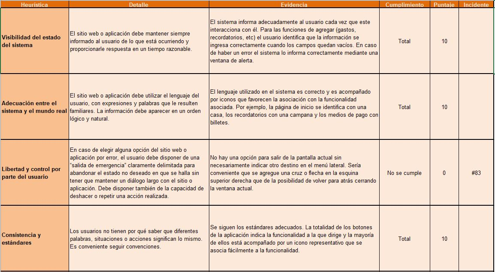
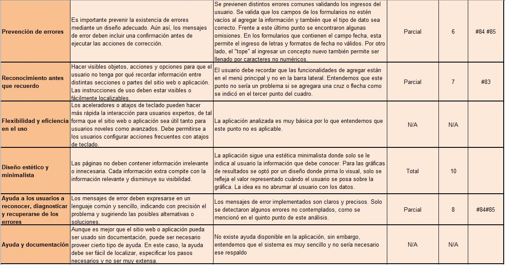
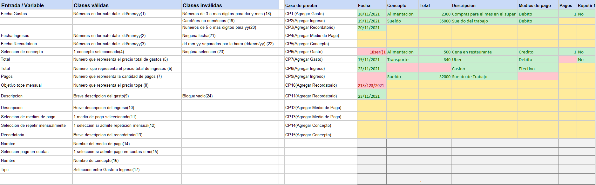
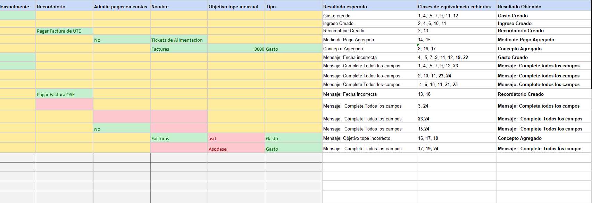

# Informe académico entrega 2
Fecha de entrega: 29-nov-2021

[Proyecto Mamrut, Mester, Pigatto](https://github.com/ORT-FIS-202108/proyecto-grupo_3_mamrut_mester_pigatto)

Mauricio Mamrut: 266946

Ivana Mester: 204318

Ignacio Pigatto: 204386

## Construcción

### Implementación de funciones principales (sin la necesidad de persistencia de datos)

Para la realización de la tarea decidimos implementar las funciones principales de la aplicación con el objetivo de obtener el mínimo producto viable. Dejamos de lado las funcionalidades que no aportan demasiado valor o aquellas que implican una implementación demasiado compleja.

#### Funcionalidades a implementar:

<ol><li>Visualización de gastos e ingresos de forma ordenada.</li><li>Posibilidad de crear recordatorios, categorías de gastos e ingresos personalizadas y diferentes tipos de medios de pago </li><li>Ingresar gastos e ingresos de forma manual</li><li>Establecer topes de gasto mensual en las diferentes categorías</li><li>Visualización de gastos e ingresos en forma de gráfica</li></ol>

#### Funcionalidades que no se implementarán en esta versión:

<ol><li>Posibilidad de escanear facturas</li><li>Ingreso de gastos en más de una moneda</li><li>El usuario debe poder establecer topes de gastos por categoría mensual, y ser notificado en caso de sobrepasar esos límites.</li><li>Ingreso de gastos recurrentes una única vez que luego se asignen todos los meses de forma automática.</li><li>Posibilidad del usuario de utilizar categorías personalizadas a las que asignar sus gastos e ingresos</li></ol>

### Configuración de plataforma tecnológica para desarrollo y producción

Para comenzar a trabajar  partimos del template proporcionado en la propuesta e instalamos node en nuestras respectivas computadoras. Luego ejecutamos el comando 'npm install' para instalar los módulos en el proyecto. Mediante el comando 'npm run start' en la terminal ejecutamos la aplicación en el servidor local para emplezar a trabajar.

### Documentación del uso de librerías externas (package.json)

Para llevar a cabo el proyecto utilizamos diferentes librerías externas. Algunas de ellas son Jest, para la realización de tests unitarios sobre las clases del dominio, Material Design para el diseño de la interfaz, y ESLint para la revisión del código de JavaScript. Además, como facilitador para realizar los gráficos de resultados, ingresos y gastos, planteados en una primera etapa en el boceto de la interfaz, utilizamos la libreria Chart.js. Las distintas dependencias utilizadas en dominio e interfaz pueden verse en sus correspondientes archivos package.json.

#### package.json dominio


#### package.json interfaz


## Interfaz de usuario

### Interfaz de usuario web / mobile (responsive)

Al crear nuestra aplicación intentamos contemplar los distintos tamaños de pantalla posibles, para hacer que la misma se adapte a ellos, acomodando el diseño cuando sea necesario. Un ejemplo de esto es que el menu lateral se oculta automáticante cuando el tamaño de la pantalla es menor a determinados pixeles, indicado en el index.scss. Además, en los casos posibles intentamos definir los tamaños de los distintos elementos dispuestos en la aplicación como porcentajes del tamaño de su componente padre, esto genera que al hacer variar el tamaño de la pantalla, los mismos se acomoden a este. 

### Página única con navegación entre secciones

Para el desarrollo de nuestra aplicación implementamos una página única (index.html) con navegación entre secciones. Utilizamos la tag 'section' de HTML para crear las distinas secciones de nuestra aplicación que queríamos mostrar y dependiendo las diferentes acciones del usuario al utilizarla, qué secciones se despliegan y cuáles no. 

Para poder lograr esto, en el index.js obtenemos la sección que queremos mostrar u ocultar y la ocultamos mediante la siguiente línea de código: 

```
document.getElementById('idDelComponente').style.display = "none";
```

O la mostramos mediante:

```
document.getElementById('idDelComponente').style.display = "block";
```

Existen distintos botones en la aplicación que generan este tipo de acción. Un ejemplo es el botón de la top bar, con el texto 'Mis Gastos'. Al hacer click en este botón se vuelve a la página de inicio sin importar en qué sección se encuentre el usuario. 

### Implementación: Material Design Web Components

Para realizar un diseño más dinámico y sencillo de implementar, utilizamos como sistema de diseño Material Design Web Components. Basándonos en nuestros bocetos iniciales y viendo la variedad de componentes disponibles en Material Design, es que fuimos creando nuestra aplicación. Material Design provee una gran cantidad de componentes ya armados y costumizables, lo que facilitó y agilizó el proceso de diseño de interfaz. 

Para poder estilar los diferentes componentes es necesario importarlos en el archivo de estilos (index.scss), utilizando @use. A continuación un ejemplo de dos componentes utilizados en nuestra aplicación. 

``` 
@use '@material/button';
@use "@material/textfield";
```

Por su parte para poder darle funcionalidad a estos componentes es necesario, a su vez, realizar el import correspondiente en el archivo index.js. Una vez que se realizó la importación, los componentes deberán ser inicializados para poder ser utilizados. 

```
import { MDCRipple } from '@material/ripple';
import { MDCTextField } from '@material/textfield';

const addButtonGastos = new MDCRipple(document.getElementById('addButtonGastos'));
const textFieldFechaIngreso = new MDCTextField(document.getElementById('fechaIngreso'));
```

Un ejemplo de componente de Material Design utilizado en nuestra aplicación es el del TextField. El mismo ya provee el formato que incluye un placeholder que indica qué dato se espera, y luego, una vez los datos son ingresados, se visualiza una label a modo indicativo por sobre el TextField. Además, al ser clickeado para ingresar los datos, el TextField cambia de color automáticamente, para mostrarse seleccionado.

#### Ejemplo TextField vacío


#### Ejemplo TextField seleccionado


#### Ejemplo TextField completado


### Aplicar un sistema de diseño y principios de usabilidad

Para evaluar la usabilidad utilizamos el template que vimos en clase:




### Cumplimiento de estándar de accesibilidad WCAG

### Seguir especificación de estilo

## Codificación

### IDE Visual Studio Code: configuración común del equipo

### Estándares de codificación Google (HTML, CSS, JavaScript)

### Buenas prácticas de OOP: separación de lógica e interfaz

### Análisis estático de código: mostrar reducción de problemas

## Test unitario

### Test unitarios en Jest

Para realizar las pruebas unitarias en nuestro proyecto utilizamos el framework Jest. Para ellos creamos un archivo para realizar estos tests por cada archivo de clases del dominio. En nuestro caso eran dos. Para testear el archivo clases.mjs, creamos el archivo clases.test.js con los tests correspondientes, y para el archivo sistema.mjs, creamos sistema.test.js, también con sus tests correspondientes. Cada función de cada clase es evaluada por un test. Intentamos cubirir todos los casos positivos, pero también incluimos tests negativos, es decis, casos que serían erroneos. 

A continuación se presentan dos ejemplos de dos tests de la misma función de la clase sistema, uno positivo y uno negativo. 

```
test('Borrar elemento lista', () => {
  const unSistema = new Sistema();
  const recordatorio1 = new Recordatorio('28/02/2020', 'Llamar Juan');
  const recordatorio2 = new Recordatorio('28/02/2021', 'Llamar Juan');
  unSistema.agregarRecordatorio(recordatorio1);
  unSistema.agregarRecordatorio(recordatorio2);
  unSistema.borrarElemento(unSistema.recordatorios, 1);
  expect(unSistema.recordatorios).toEqual([recordatorio1]);
});

test('Borrar elemento lista pasando como parámetro una posición que no existe', () => {
  const unSistema = new Sistema();
  const recordatorio1 = new Recordatorio('28/02/2020', 'Llamar Juan');
  const recordatorio2 = new Recordatorio('28/02/2021', 'Llamar Juan');
  unSistema.agregarRecordatorio(recordatorio1);
  unSistema.agregarRecordatorio(recordatorio2);
  unSistema.borrarElemento(unSistema.recordatorios, 2);
  expect(unSistema.recordatorios).toEqual([recordatorio1, recordatorio2]);
});

// ----------------------------------------------------------------------------------------

test('Calcular total ingresos', () => {
  const unSistema = new Sistema();
  const ingreso1 = new Ingreso('28/01/2020', 'Sueldo', 7500, 'Sueldo enero', 'Efectivo');
  const ingreso2 = new Ingreso('28/02/2021', 'Sueldo', 10500, 'Sueldo febrero', 'Efectivo');
  unSistema.agregarIngreso(ingreso1);
  unSistema.agregarIngreso(ingreso2);
  expect(unSistema.totalIngresos()).toBe(18000);
});

test('Calcular total ingresos cuando no hay ingresos', () => {
  const unSistema = new Sistema();
  expect(unSistema.totalIngresos()).toBe(0);
});
```

### 100% cobertura en clases de dominio

Al momento de realizar los tests unitarios, tuvimos en cuenta que los mismos testearan el 100% de nuestras clases del dominio. Como evidencia de esto se puede ver el resumen que arroja jest al correr los tests. 


Es importante destacar que de los 29 tests realizados, 2 no dan resultados correctos. Los mismos son los tests de las funciones de la clase Sistema ordenarGastosPorFecha() y ordenarIngresosPorFecha(). Luego de haber investigado estos errores e intentar solucionarlos, no logramos encontrar la falla. Sin embargo, a pesar que el test falla, las funciones parecerían funcionar adecuadamente en la aplicación. Se puede observar que al ingresar gastos e ingresos al sistema, los mismos luego se despliegan correctamente, ordenados por fecha, de más reciente a más antiguo. Esto defecto quedó adecuadamente reportado como el issue #75. 

Los tests que presentan fallas son los siguientes:

```
// -------------------- ver issue #75 -------------------------

test('Ordenar gastos por fecha', () => {
  const unSistema = new Sistema();
  const gasto1 = new Gasto('20/01/2020', 'Vestimenta', 2500, 'Compra vestido casamiento Ana', 'Efectivo', 1, 'No');
  const gasto2 = new Gasto('20/02/2021', 'Vestimenta', 2500, 'Compra vestido casamiento Ana', 'Efectivo', 1, 'No');
  unSistema.agregarGasto(gasto1);
  unSistema.agregarGasto(gasto2);
  unSistema.ordenarGastosPorFecha();
  expect(unSistema.gastos).toEqual([gasto2, gasto1]);
});

test('Ordenar ingresos por fecha', () => {
  const unSistema = new Sistema();
  const ingreso1 = new Ingreso('28/02/2020', 'Sueldo', 10500, 'Sueldo febrero', 'Efectivo');
  const ingreso2 = new Ingreso('28/02/2021', 'Sueldo', 10500, 'Sueldo febrero', 'Efectivo');
  unSistema.agregarIngreso(ingreso1);
  unSistema.agregarIngreso(ingreso2);
  unSistema.ordenarIngresosPorFecha();
  expect(unSistema.ingresos).toEqual([ingreso2, ingreso1]);
});

// ---------------------------------------------------------------
```

## Test de sistema

### Realizar test de sistema en un entorno separado del desarrollo

### Generar casos de prueba aplicando técnica partición equivalente

 

### Detallar sesiones de prueba exploratoria

## Reporte de issues

### Reportar issues (bugs, improvements, missing features) en GitHub 

### Aplicar buenas prácticas de reporte de issues

### Definir labels para tipos de issue y niveles de severidad

### Dejar issues abiertos para correcciones o mejoras futuras

### Sumarizar número de issues reportados por tipo

### Realizar una evaluación global de la calidad

## Reflexión

### Detalle del trabajo individual

### Técnicas aplicadas y aprendizajes
