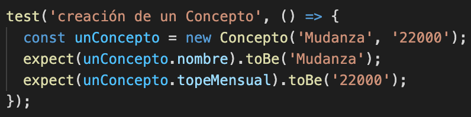

# Informe académico entrega 2
Fecha de entrega: 29-nov-2021

[Proyecto Mamrut, Mester, Pigatto](https://github.com/ORT-FIS-202108/proyecto-grupo_3_mamrut_mester_pigatto)

Mauricio Mamrut: 266946

Ivana Mester: 204318

Ignacio Pigatto: 204386

## Construcción

### Implementación de funciones principales (sin la necesidad de persistencia de datos)

Para la realización de la tarea decidimos implementar las funciones principales de la aplicación con el objetivo de obtener el mínimo producto viable. Dejamos de lado las funcionalidades que no aportan demasiado valor o aquellas que implican una implementación demasiado compleja.

#### Funcionalidades a implementar:

<ol><li>Visualización de gastos e ingresos de forma ordenada.</li><li>Posibilidad de crear recordatorios, categorías de gastos e ingresos personalizadas y diferentes tipos de medios de pago </li><li>Ingresar gastos e ingresos de forma manual</li><li>Establecer topes de gasto mensual en las diferentes categorías</li><li>Visualización de gastos e ingresos en forma de gráfica</li></ol>

#### Funcionalidades que no se implementarán en esta versión:

<ol><li>Posibilidad registrarse y loggearse como usuario</li><li>Posibilidad de escanear facturas</li><li>Ingreso de gastos en más de una moneda</li><li>El usuario debe poder establecer topes de gastos por categoría mensual, y ser notificado en caso de sobrepasar esos límites.</li><li>Ingreso de gastos recurrentes una única vez que luego se asignen todos los meses de forma automática.</li><li>Posibilidad del usuario de utilizar categorías personalizadas a las que asignar sus gastos e ingresos</li></ol>

### Configuración de plataforma tecnológica para desarrollo y producción

Para comenzar a trabajar  partimos del template proporcionado en la propuesta e instalamos node en nuestras respectivas computadoras. Luego ejecutamos el comando 'npm install' para instalar los módulos en el proyecto. Mediante el comando 'npm run start' en la terminal ejecutamos la aplicación en el servidor local para emplezar a trabajar.

### Documentación del uso de librerías externas (package.json)

Para llevar a cabo el proyecto utilizamos diferentes librerías externas. Algunas de ellas son Jest, para la realización de tests unitarios sobre las clases del dominio, Material Design para el diseño de la interfaz, y ESLint para la revisión del código de JavaScript. Además, como facilitador para realizar los gráficos de resultados, ingresos y gastos, planteados en una primera etapa en el boceto de la interfaz, utilizamos la libreria Chart.js. Las distintas dependencias utilizadas en dominio e interfaz pueden verse en sus correspondientes archivos package.json.

#### package.json dominio


#### package.json interfaz


## Interfaz de usuario

### Interfaz de usuario web / mobile (responsive)

Al crear nuestra aplicación intentamos contemplar los distintos tamaños de pantalla posibles, para hacer que la misma se adapte a ellos, acomodando el diseño cuando sea necesario. Un ejemplo de esto es que el menu lateral se oculta automáticante cuando el tamaño de la pantalla es menor a determinados pixeles, indicado en el index.scss. Además, en los casos posibles intentamos definir los tamaños de los distintos elementos dispuestos en la aplicación como porcentajes del tamaño de su componente padre, esto genera que al hacer variar el tamaño de la pantalla, los mismos se acomoden a este. 

### Página única con navegación entre secciones

Para el desarrollo de nuestra aplicación implementamos una página única (index.html) con navegación entre secciones. Utilizamos la tag 'section' de HTML para crear las distinas secciones de nuestra aplicación que queríamos mostrar y dependiendo las diferentes acciones del usuario al utilizarla, qué secciones se despliegan y cuáles no. 

Para poder lograr esto, en el index.js obtenemos la sección que queremos mostrar u ocultar y la ocultamos mediante la siguiente línea de código: 

```
document.getElementById('idDelComponente').style.display = "none";
```

O la mostramos mediante:

```
document.getElementById('idDelComponente').style.display = "block";
```

Existen distintos botones en la aplicación que generan este tipo de acción. Un ejemplo es el botón de la top bar, con el texto 'Mis Gastos'. Al hacer click en este botón se vuelve a la página de inicio sin importar en qué sección se encuentre el usuario. 

### Implementación: Material Design Web Components

Para realizar un diseño más dinámico y sencillo de implementar, utilizamos como sistema de diseño Material Design Web Components. Basándonos en nuestros bocetos iniciales y viendo la variedad de componentes disponibles en Material Design, es que fuimos creando nuestra aplicación. Material Design provee una gran cantidad de componentes ya armados y personalizables, lo que facilitó y agilizó el proceso de diseño de interfaz. 

Para poder estilar los diferentes componentes es necesario importarlos en el archivo de estilos (index.scss), utilizando @use. A continuación un ejemplo de dos componentes utilizados en nuestra aplicación. 

``` 
@use '@material/button';
@use "@material/textfield";
```

Por su parte para poder darle funcionalidad a estos componentes es necesario, a su vez, realizar el import correspondiente en el archivo index.js. Una vez que se realizó la importación, los componentes deberán ser inicializados para poder ser utilizados. 

```
import { MDCRipple } from '@material/ripple';
import { MDCTextField } from '@material/textfield';

const addButtonGastos = new MDCRipple(document.getElementById('addButtonGastos'));
const textFieldFechaIngreso = new MDCTextField(document.getElementById('fechaIngreso'));
```

Un ejemplo de componente de Material Design utilizado en nuestra aplicación es el del TextField. El mismo ya provee el formato que incluye un placeholder que indica qué dato se espera, y luego, una vez los datos son ingresados, se visualiza una label a modo indicativo por sobre el TextField. Además, al ser clickeado para ingresar los datos, el TextField cambia de color automáticamente, para mostrarse seleccionado.

#### Ejemplo TextField vacío


#### Ejemplo TextField seleccionado


#### Ejemplo TextField completado


### Aplicar un sistema de diseño y principios de usabilidad

Para evaluar la usabilidad utilizamos el template que vimos en clase:


### Cumplimiento de estándar de accesibilidad WCAG

Dentro del alcance de nuestra aplicación, en esta primera instancia, intentamos cumplir con los estándares de accesibilidad WCAG. Nuestra aplicación tiene poco contenido, que es relevante y claro, con títulos indicativos. Se intentó no agregar gran cantidad de texto, para que sea fácilmente legible y comprensible a la vista. Los botones tienen textos claros, y en los casos pertinentes los textos están acompañados de íconos representativos. Se utilizan colores que contrastan para resaltar aspectos importantes. En los casos en que el usuario puede cometer errores, se emite una alerta con un texto claro sobre cuál es el error para que el usuario pueda corregirlo rápidamente. Además, se incorporó el uso de gráficos para mostrar los resultados de forma clara y sencilla. Se intenta que el flujo para navegar sea sencillo de seguir.

En esta primera instancia, no fue posible incorporar funcionalidades desde el teclado, ya que se atacaron las funcionalidades básicas. 

### Seguir especificación de estilo

Para llevar a cabo nuestro proyecto consideramos las especificaciones de estilo proporcionadas por la cátedra. Estas se referían principalmente al nombre de la aplicación, "Mis Gastos", a la fuente, "Roboto" y a los colores a utilizar en la implementación de la aplicación. 

## Codificación

### IDE Visual Studio Code: configuración común del equipo

Para realizar la aplicación utilizamos el IDE Visual Studio Code. Considerando que este IDE ya había sido utilizado para materias anteriores de la carrera, no fue necesario realizar una configuración común, aunque sí realizamos en conjunto la instalación de node JS, ya que no lo habíamos utilizado previamente, e hicimos una primera reunión para definir ciertos estándares para seguir, con el objetivo de facilitar el trabajo en equipo. 

### Estándares de codificación Google (HTML, CSS, JavaScript)

Para asegurar los estándares de codificación de Google en nuestro código JavaScript utilizamos esLint. El mismo, al instalarlo, permite seleccionar la opción correspondiente para seguir los estándares de Google, que fue lo que hicimos. Una vez instalado esLint en el dominio, el mismo se encargaba de marcar aquellos errores que debíamos corregir para cumplir con los estándares. 

En cuanto al código HTML y CSS, considerando que no contábamos con una solución disponible como esLint, fue necesario buscar los principales estándares de Google para aplicarlos. Un ejemplo puede ser la indentación del código. VSC permite predefinir la indentación que se quiere mantener, según estándares de Google, la misma es de dos espacios. Además, pasamos nuestro código por un validador de código HTML para validar posibles errores o mejoras.

### Buenas prácticas de OOP: separación de lógica e interfaz

Nuestro proyecto tiene claramente separada la lógica de la interfaz. Para ello, dividimos el código en dos carpetas, "dominio" e "interfaz". Cada una de ella tiene instalado los módulos de Node por separado, para poder instalar las distintas librerías y dependencias donde fueran a ser utilizadas. 

Dentro del dominio definimos dos archivos de clases, "sistema.mjs" y "clases.mjs", cada uno de estos archivos tiene su correspondiente archivo de pruebas unitarias. Por su parte, dentro de la carpeta interfaz encontramos el archivo index.html, con el diseño de nuestra interfaz, el archivo de estilos, index.scss, y el archivo index.js, responsable de la integración del dominio con la interfaz. 

### Análisis estático de código: mostrar reducción de problemas

Para realizar el análisis estático de código utilizamos ESLint, que sin necesidad de correr el programa, indica posibles errores y estándares que no se están siguiendo correctamente.

A continuación presentamos evidencia de algunos problemas resueltos con ESLint.

#### Funciones con problemas


#### Resolución




## Test unitario

### Test unitarios en Jest

Para realizar las pruebas unitarias en nuestro proyecto utilizamos el framework Jest. Para ellos creamos un archivo para realizar estos tests por cada archivo de clases del dominio. En nuestro caso eran dos. Para testear el archivo clases.mjs, creamos el archivo clases.test.js con los tests correspondientes, y para el archivo sistema.mjs, creamos sistema.test.js, también con sus tests correspondientes. Cada función de cada clase es evaluada por un test. Intentamos cubirir todos los casos positivos, pero también incluimos tests negativos, es decis, casos que serían erróneos. 

A continuación se presentan dos ejemplos de dos tests de la misma función de la clase sistema, uno positivo y uno negativo. 

```
test('Borrar elemento lista', () => {
  const unSistema = new Sistema();
  const recordatorio1 = new Recordatorio('28/02/2020', 'Llamar Juan');
  const recordatorio2 = new Recordatorio('28/02/2021', 'Llamar Juan');
  unSistema.agregarRecordatorio(recordatorio1);
  unSistema.agregarRecordatorio(recordatorio2);
  unSistema.borrarElemento(unSistema.recordatorios, 1);
  expect(unSistema.recordatorios).toEqual([recordatorio1]);
});

test('Borrar elemento lista pasando como parámetro una posición que no existe', () => {
  const unSistema = new Sistema();
  const recordatorio1 = new Recordatorio('28/02/2020', 'Llamar Juan');
  const recordatorio2 = new Recordatorio('28/02/2021', 'Llamar Juan');
  unSistema.agregarRecordatorio(recordatorio1);
  unSistema.agregarRecordatorio(recordatorio2);
  unSistema.borrarElemento(unSistema.recordatorios, 2);
  expect(unSistema.recordatorios).toEqual([recordatorio1, recordatorio2]);
});

// ----------------------------------------------------------------------------------------

test('Calcular total ingresos', () => {
  const unSistema = new Sistema();
  const ingreso1 = new Ingreso('28/01/2020', 'Sueldo', 7500, 'Sueldo enero', 'Efectivo');
  const ingreso2 = new Ingreso('28/02/2021', 'Sueldo', 10500, 'Sueldo febrero', 'Efectivo');
  unSistema.agregarIngreso(ingreso1);
  unSistema.agregarIngreso(ingreso2);
  expect(unSistema.totalIngresos()).toBe(18000);
});

test('Calcular total ingresos cuando no hay ingresos', () => {
  const unSistema = new Sistema();
  expect(unSistema.totalIngresos()).toBe(0);
});
```

### 100% cobertura en clases de dominio

Al momento de realizar los tests unitarios, tuvimos en cuenta que los mismos testearan el 100% de nuestras clases del dominio. Como evidencia de esto se puede ver el resumen que arroja jest al correr los tests. 


Es importante destacar que de los 29 tests realizados, 2 no dan resultados correctos. Los mismos son los tests de las funciones de la clase Sistema ordenarGastosPorFecha() y ordenarIngresosPorFecha(). Luego de haber investigado estos errores e intentar solucionarlos, no logramos encontrar la falla. Sin embargo, a pesar que el test falla, las funciones parecerían funcionar adecuadamente en la aplicación. Se puede observar que al ingresar gastos e ingresos al sistema, los mismos luego se despliegan correctamente, ordenados por fecha, de más reciente a más antiguo. Esto defecto quedó adecuadamente reportado como el issue #75. 

Los tests que presentan fallas son los siguientes:

```
// -------------------- ver issue #75 -------------------------

test('Ordenar gastos por fecha', () => {
  const unSistema = new Sistema();
  const gasto1 = new Gasto('20/01/2020', 'Vestimenta', 2500, 'Compra vestido casamiento Ana', 'Efectivo', 1, 'No');
  const gasto2 = new Gasto('20/02/2021', 'Vestimenta', 2500, 'Compra vestido casamiento Ana', 'Efectivo', 1, 'No');
  unSistema.agregarGasto(gasto1);
  unSistema.agregarGasto(gasto2);
  unSistema.ordenarGastosPorFecha();
  expect(unSistema.gastos).toEqual([gasto2, gasto1]);
});

test('Ordenar ingresos por fecha', () => {
  const unSistema = new Sistema();
  const ingreso1 = new Ingreso('28/02/2020', 'Sueldo', 10500, 'Sueldo febrero', 'Efectivo');
  const ingreso2 = new Ingreso('28/02/2021', 'Sueldo', 10500, 'Sueldo febrero', 'Efectivo');
  unSistema.agregarIngreso(ingreso1);
  unSistema.agregarIngreso(ingreso2);
  unSistema.ordenarIngresosPorFecha();
  expect(unSistema.ingresos).toEqual([ingreso2, ingreso1]);
});

// ---------------------------------------------------------------
```

## Test de sistema

### Realizar test de sistema en un entorno separado del desarrollo

### Generar casos de prueba aplicando técnica partición equivalente

  

### Detallar sesiones de prueba exploratoria

Se presenta la documentación de tres sesiones de testing exploratorio.

#### Sesión 1:


#### Sesión 2:


#### Sesión 3:

## Reporte de issues

### Reportar issues (bugs, improvements, missing features) en GitHub 

Durante todo el proceso de creación del proyecto fuimos reportando issues en GitHub sobre aquellos defectos o posibles mejoras que íbamos encontrando. Gran parte de los issues reportados durante la etapa de codificación se fueron solucionando, aunque algunos quedaron abiertos para una segunda versión de la aplicación. Posteriormente, durante el proceso de testing, fue que se reportó la mayor cantidad de issues, ya que en ese tiempo el equipo se concentró en probar el sistema para encontrar defectos. 

También se encuentran reportadas como issues aquellas funcionalidades que en esta primera instancia no fueron incluidas en la aplicación pero sí habría intención de incorporarlas en un futuro.

### Aplicar buenas prácticas de reporte de issues

Se intentó aplicar buenas prácticas de reporte de issues al crearlos, ya que esto facilita su posterior resolución. Los issues creados tienen un título descriptivo del defecto, etiquetas para indicar la temática, un resumen que explica con mayor detalle el problema, la prioridad del mismo y, en los casos en que correponde, los pasos para reproducirlo. 

### Definir labels para tipos de issue y niveles de severidad

Las principales labels que utilizamos para categorizar los issues son las siguientes.

<ul><li>bug: algo no funciona correctamente</li><li>frontend: problema en el diseño de la interfaz </li><li>enhancement: no es un error, pero podría funcionar o verse mejor</li><li>proxima etapa: funcionalidades que no se implementaron en la primera versión de la aplicación pero se deberían implementar en la siguiente</li></ul>

Algunas de estas labels son proporcionadas por GitHub, otras las definimos nosotros de acuerdo a las necesidades de nuestro proyecto.

En relación a los niveles de severidad, definimos tres posibles categorías. 

<ul><li>Prioridad Alta: Debería solucionarse antes de lanzar la aplicación a un ambiente de producción.</li><li>Prioridad Media: No es urgente pero debería solucionarse en el corto o mediano plazo.</li><li>Prioridad Baja: Se puede resolver en una segunda versión de la aplicación.</li></ul>

### Dejar issues abiertos para correcciones o mejoras futuras

Como se mencionó anteriormente, a lo largo del desarrollo del proyecto fuimos reportando distintos issues, algunos de ellos fueron solucionados y correctamente cerrados, otros quedaron abiertos para ser solucionados en una segunda instancia. Entre los issues que quedaron abiertos se encuentran definidas aquellas funcionalidades que no se implementaron en esta primera versión de la aplicación. También hay defectos abiertos que surgieron a partir de la etapa de testing. 

Estos issues se encuentran en la pestaña de "issues" de GitHub, figuran como "open issues".

### Sumarizar número de issues reportados por tipo

<ul><li>Errores en formularios: 3 (#84, #85, #91)</li><li>Omisiones de funcionalidades: 1 (#92)</li><li>Funcionalidades a agregar en el futuro: 7 (#83, #94, #95, #96, #97, #98, #99)</li><li>Errores en las pruebas unitarias: 1 (#75)</li><li>Issues cerrados: 8 (#44, #46, #48, #52, #58, #59, #62, #66)</li></ul>

### Realizar una evaluación global de la calidad

Entendemos que nuestra aplicación tiene incorporadas todas las funcionalidades en las que se decidió trabajar en esta primera etapa del proyecto, y en general el funcionamiento de la misma es correcto. Sin embargo, creemos que nuestro código aún no estaría apto para pasar a un ambiente de producción ya que continúa habiendo algunos issues abiertos con prioridad alta, que según nuestra definión, deberían ser solucionados antes de pasar la aplicación a un ambiente de producción. En general estos issues se refieren a algunos casos puntuales que no funcionan adecuadamente, pero impiden el correcto de la aplicación, como por ejemplo el issue #84, que establece que la fecha no se valida correctamente en los formularios. 

Una vez solucionados estos issues con prioridad alta, quedarían algunos abiertos que, a nuestro entender, no impedirían sí poder pasar la aplicación a un ambiente de producción, ya que podrían ser atacados en próximas etapas. 

## Reflexión

### Detalle del trabajo individual

#### Reflexión Ivana

Me resultó sumamente interesante realizar este proyecto, ya que me ayudó a obtener un entendimiento global de lo que es trabajar en un proyecto de principio a fin, abarcando todas sus etapas. Desde el lado de la interfaz pude conocer Material Design, que, a pesar de tener cierto grado de complejidad y que en ocasiones los componentes no resultan tan sencillos de implementar, considero que fue un gran aporte a la interfaz de la aplicación, también teniendo en cuenta que contábamos con tiempo limitado para realizarla, y de no contar con Material Design todo debería haber sido creado desde cero. En cuanto al dominio, a pesar que ya habíamos tenido la oportunidad de codificar con JavaScript, personalmente nunca había trabajado con pruebas unitarias y creo que incorporarlas resultó de gran ayuda para identificar errores y obtener un mejor entendimiento del código. Finalmente, al trabajar en la parte de testing creo que tuvimos la oportunidad de chequear nuestro trabajo y entender que quizás algunos elementos hubieran sido más sencillos de llevar a cabo si el proceso de planificación hubiera sido diferente en algunos aspectos, lo que resultó ser un aprendizaje para futuros proyectos.

Por su parte, trabajar con GitHub para realizar el trabajo en equipo fue un gran facilitador en relación a cómo trabajábmos en materias anteriores, que trabajar en paralelo no resultaba tan sencillo. 

Creo que como equipo tuvimos el desafío de enfretarnos a nuevas tecnologías que ninguno conocía, lo que representaba ciertos obstáculos. En algunos casos se resolvían consultándonos entre nosotros, o realizando videollamadas para intentar resolver problemas en conjunto. En otros casos era necesario recurrir a la documentación de las tecnologías utilizadas, principalmente en el caso de Material Design, o realizar la correspondiente búsqueda en internet para obtener las soluciones buscadas. 

#### Reflexión Mauricio

Trabajar en el proyecto representó un gran desafío. Al no tener experiencia en el desarrollo de aplicaciones hubo muchas cosas con las que tuve que familiarizarme en el proyecto. El uso de Material Design así como la codificación en JavaScript dio bastante trabajo al principio, sin embargo luego lo manejamos con más fluidez. 
Para dominar las tecnologías resultó muy útil la documentación encontrada en internet así como también la ayuda de los ayudantes de cátedra en situaciones que no sabíamos resolver.
En relación al trabajo en equipo, dividimos las tareas para poder avanzar trabajando al paralelo y realizamos reuniones periódicas para mostrar los avances y trabajar en los puntos más complejos.

#### Reflexión Ignacio

Desde mi punto de vista, trabajar en este proyecto me ayudo a trabajar en equipo de manera optima para llevar a cabo objetivos de forma conjunta. Lo que al principio parecía ser un gran desafío, las distintas herramientas aprendidas a lo largo del curso hicieron posible realizar los objetivos planteados. Me gusto mucho hacer la tarea porque me llevo un montón de aprendizaje que me acerca a lo que es trabajar junto a un equipo en cualquier proyecto laboral.

Por último, como equipo, el trabajo día a día en conjunto simplifico la realización de tareas y con mis compañeros terminamos muy conformes con los resultados obtenidos.

### Técnicas aplicadas y aprendizajes

Como modalidad de trabajo dividimos las diferentes tareas a realizar para poder avanzar en simultáneo. Realizamos reuniones periódicas por Zoom donde explicábamos los avances y resolvíamos problemas entre todos.

Comenzamos aprendiendo el uso de Material Design utilizando la documentación proporcionada en la propuesta del trabajo. En un comienzo nos costó entender su forma de uso pero luego nos logramos familiarizar con los componentes y logramos sacarles provecho.

Por otro lado, aprendimos las ventajas del uso de librerías externas en el proyecto. En una primera instancia nos preocupaba no saber cómo implementar las gráficas que habíamos planificado incluir pero logramos hacerlo fácilmente utilizando Charts.js.

El uso de ESLint en un comienzo nos resultaba abrumador, debido a que encontraba errores en todo el código y era "molesto" para trabajar. Cuando nos familiarizamos con los estándares de codificación logramos incorporarlos a nuestra forma de trabajo y el corrector dejó de ser un problema. Esto mismo nos sucedió con el reporte de issues en Git, luego de reportar algunos issues sin seguir un mismo patrón nos pusimos de acuerdo y adoptamos una forma única de reportar de forma ordenada.

Para que el trabajo fuera fácil de seguir, intentamos incluir títulos comentados en cada sección de código, siguiendo un mismo orden. De esta forma nos fue sencillo trabajar sin perdernos en las muchas de líneas de código.
